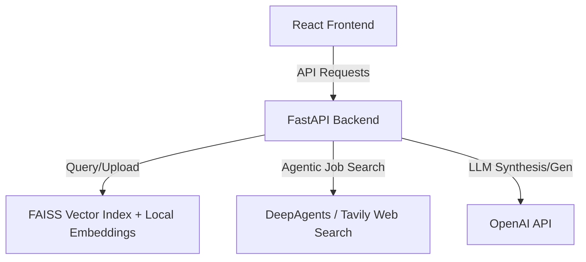

# Implementation Plan - Unified Backend Integration

This plan outlines the architecture and steps to build the FastAPI backend for the AI Campus & Career Assistant, integrating the semantic RAG search from the college assistant, the agentic job search/resume matching system from Project 2 (using `deepagents` and Tavily), and the interview prep question generator.

---

## Proposed Architecture

We will create a `backend/` directory inside the workspace `c:\add-on-team7` with a FastAPI server.



---

## Proposed Changes

### 1. Backend Components

#### [NEW] [main.py](file:///c:/add-on-team7/backend/main.py)
Create the main FastAPI application file with the following endpoints:
* `/api/status`: Check backend status.
* `/api/college/query`: RAG query over indexed college documents using FAISS and local `sentence-transformers` (from `add-on-team-7`).
* `/api/college/upload`: Upload new PDF/DOCX/TXT files to index into the FAISS database.
* `/api/job/analyze`: Parse the uploaded resume, generate ATS score, provide analysis points, use `deepagents` and Tavily to fetch real matching jobs, and generate cover letters.
* `/api/interview/questions`: Generate custom interview questions using OpenAI based on the selected role.

#### [NEW] [backend_service.py](file:///c:/add-on-team7/backend/backend_service.py)
Bring in the `DocumentProcessor` and `KnowledgeBaseManager` from `c:\add-on-team-7\backend_service.py` to handle chunking, local embedding, and FAISS indexing.

#### [NEW] [requirements.txt](file:///c:/add-on-team7/backend/requirements.txt)
Define the python requirements:
```txt
fastapi
uvicorn
python-multipart
sentence-transformers
faiss-cpu
pandas
numpy
pypdf
python-docx
openai
python-dotenv
tavily-python
deepagents
```

---

### 2. Frontend Changes

We will wire up the React pages to make API calls to `http://127.0.0.1:8000`.

#### [MODIFY] [CollegeAssistant.jsx](file:///c:/add-on-team7/src/pages/CollegeAssistant.jsx)
* Call `/api/college/query` to get real RAG responses and sources.
* Add an OpenAI API key input field in the UI (or read from `.env`).

#### [MODIFY] [JobAssistant.jsx](file:///c:/add-on-team7/src/pages/JobAssistant.jsx)
* Hook up the resume file input to call `/api/job/analyze`.
* Replace hardcoded ATS score, analysis bullet points, and recommended roles with real API data.
* Provide a way to specify API Keys (OpenAI, Tavily) dynamically or via backend environment config.
* Add a preview and download button for the generated cover letters (docx).

#### [MODIFY] [InterviewPrep.jsx](file:///c:/add-on-team7/src/pages/InterviewPrep.jsx)
* Wire the "Generate Questions" button to call `/api/interview/questions`.
* Display generated questions dynamically in the list.

---

## Verification Plan

### Automated/Manual Tests
1. Start the FastAPI server on port `8000`.
2. Verify all API endpoints (`/api/college/query`, `/api/job/analyze`, etc.) return valid data.
3. Start the React frontend on port `5173`.
4. Test the full flow:
   * Upload a college guidelines document, ask college policy questions, and verify sources.
   * Upload a resume, trigger matching, check ATS score, recommended jobs, and download cover letters.
   * Select a role under Interview Prep and generate questions.
